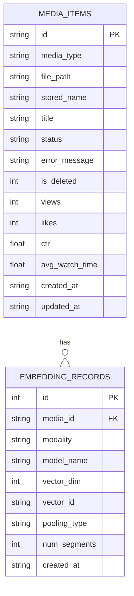

# Data Model and Schema (Image-Only)

## Current scope
The runtime system keeps only the minimum entities needed for image upload, indexing, search, and feedback-aware ranking.

## ER Diagram

## SQL source
Migration script: [backend/migrations/001_init.sql](../backend/migrations/001_init.sql)

## Media lifecycle
Allowed statuses:
- `UPLOADED`
- `PROCESSING`
- `INDEXED`
- `FAILED`
- `DELETED`

Transition policy:
1. Upload creates row with `UPLOADED`.
2. Background indexing sets `PROCESSING`.
3. On success set `INDEXED` and insert embedding metadata.
4. On failure set `FAILED` and store `error_message`.
5. Delete sets `DELETED`, marks `is_deleted = 1`, and removes stored vector artifacts.

## Notes
- `media_type` is restricted to image in current implementation.
- Historical ranking signals (`views`, `likes`, `ctr`, `avg_watch_time`) are kept in `media_items` for simplified online scoring.
- Advanced entities from earlier multimedia plan (quality table, interaction logs, snapshot table) are intentionally deferred to keep this phase mathematically focused and implementation-light.
