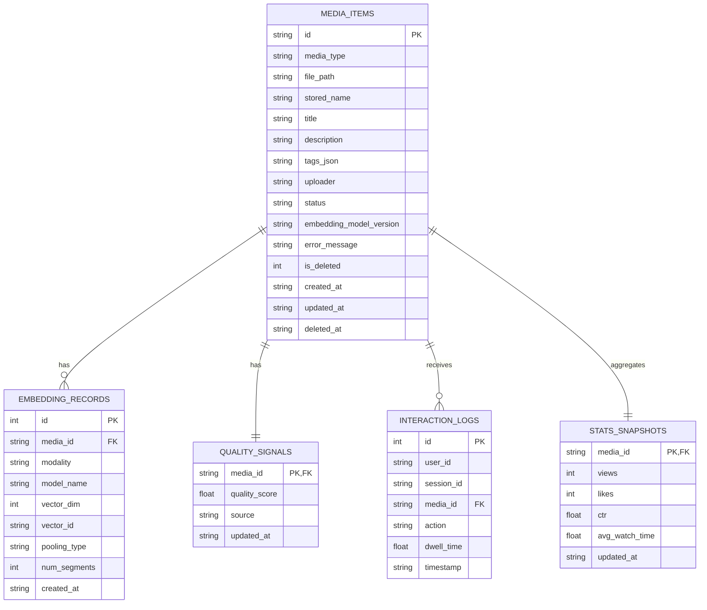

# Data Model and Schema

## ER Diagram

## SQL Schema

The migration script is in [backend/migrations/001_init.sql](../backend/migrations/001_init.sql).

## Media Lifecycle

Allowed status values:
- `UPLOADED`
- `PROCESSING`
- `INDEXED`
- `FAILED`
- `DELETED`

### Lifecycle policy

1. New upload starts as `UPLOADED`.
2. Preprocessing starts: status becomes `PROCESSING`.
3. If preprocessing succeeds: status becomes `INDEXED`.
4. If preprocessing fails: status becomes `FAILED` with `error_message`.
5. Delete action sets status to `DELETED` and `is_deleted = 1`.

### Soft-delete and hard-delete

- Soft-delete (current default): keep metadata row with `status='DELETED'` and `deleted_at`.
- Hard-delete (future admin action): remove file + DB row.

### Re-index policy

When model or preprocessing changes:
1. Update `embedding_model_version`.
2. Select items with outdated version.
3. Move those items to `UPLOADED` and queue re-index.
4. Re-run preprocessing/embedding and mark `INDEXED`.
